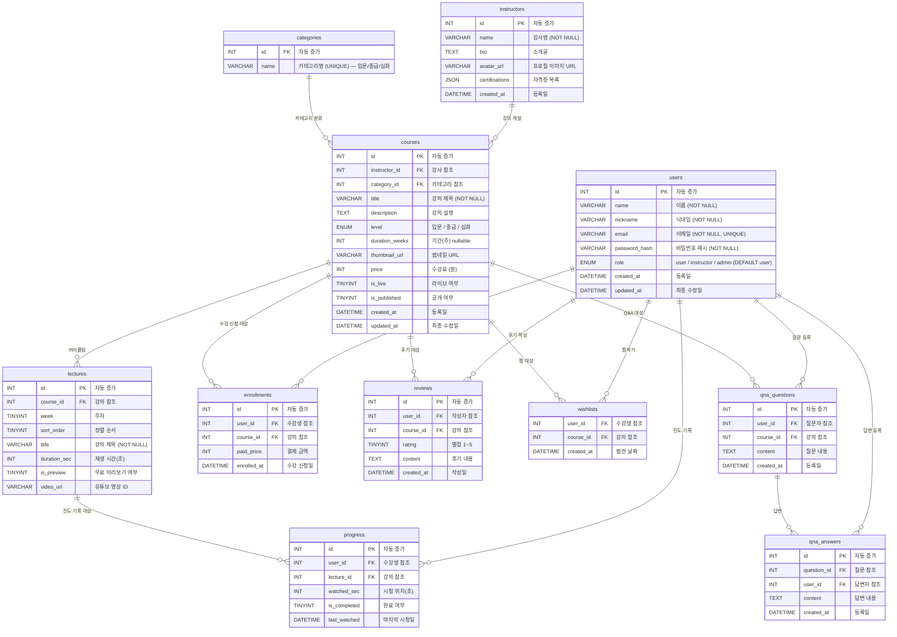

# ERD — SOMA 요가 인강 플랫폼

## 1. ER 다이어그램 (Mermaid)

## 2. 테이블 상세

### 2.1 users

| 컬럼 | 타입 | 제약조건 | 설명 |
|------|------|---------|------|
| id | INT UNSIGNED | PK, AUTO_INCREMENT | 고유 식별자 |
| name | VARCHAR(50) | NOT NULL | 실명 |
| nickname | VARCHAR(50) | NOT NULL | 닉네임 |
| email | VARCHAR(100) | NOT NULL, UNIQUE | 이메일 (로그인 ID) |
| password_hash | VARCHAR(255) | NOT NULL | bcrypt 해시 |
| role | ENUM | NOT NULL, DEFAULT 'user' | user / instructor / admin |
| created_at | DATETIME | NOT NULL | 가입일 |
| updated_at | DATETIME | NOT NULL | 최종 수정일 |

### 2.2 courses

| 컬럼 | 타입 | 제약조건 | 설명 |
|------|------|---------|------|
| id | INT UNSIGNED | PK, AUTO_INCREMENT | 고유 식별자 |
| instructor_id | INT UNSIGNED | FK → instructors(id) | 강사 |
| category_id | INT UNSIGNED | FK → categories(id) | 카테고리 |
| title | VARCHAR(200) | NOT NULL | 강의 제목 |
| level | ENUM | NOT NULL | 입문 / 중급 / 심화 |
| price | INT UNSIGNED | NOT NULL | 수강료 (원) |
| is_live | TINYINT(1) | NOT NULL, DEFAULT 0 | 라이브 여부 |
| is_published | TINYINT(1) | NOT NULL, DEFAULT 0 | 공개 여부 |

> **주의:** `lecture_count`, `total_hours`는 courses 테이블에 저장하지 않는다. lectures 테이블에서 `COUNT`, `SUM`으로 실시간 계산한다.

### 2.3 lectures

| 컬럼 | 타입 | 제약조건 | 설명 |
|------|------|---------|------|
| id | INT UNSIGNED | PK, AUTO_INCREMENT | 고유 식별자 |
| course_id | INT UNSIGNED | FK → courses(id), CASCADE | 소속 강의 |
| week | TINYINT UNSIGNED | NOT NULL, DEFAULT 1 | 주차 |
| sort_order | TINYINT UNSIGNED | NOT NULL, DEFAULT 1 | 주차 내 순서 |
| video_url | VARCHAR(255) | nullable | 유튜브 영상 ID |

### 2.4 progress

| 컬럼 | 타입 | 제약조건 | 설명 |
|------|------|---------|------|
| id | INT UNSIGNED | PK, AUTO_INCREMENT | 고유 식별자 |
| user_id | INT UNSIGNED | FK → users(id) | 수강생 |
| lecture_id | INT UNSIGNED | FK → lectures(id) | 강의 |
| watched_sec | INT UNSIGNED | NOT NULL, DEFAULT 0 | 시청 위치(초) |
| is_completed | TINYINT(1) | NOT NULL, DEFAULT 0 | 완료 여부 |
| last_watched | DATETIME | NOT NULL | 마지막 시청 시각 |

**UNIQUE KEY:** `(user_id, lecture_id)` — 수강생당 강의별 1개 레코드 (upsert)

## 3. 설계 결정 사항

### lecture_count 실시간 계산
강사가 커리큘럼을 추가/삭제할 때마다 courses 테이블의 lecture_count를 업데이트하면 정합성 문제가 생긴다. 대신 강의 목록/상세 조회 시 `COUNT(DISTINCT l.id)`로 실시간 계산한다. 강의 수가 자동으로 반영된다.

### progress upsert
같은 수강생이 같은 강의를 여러 번 시청할 때 레코드가 중복 생성되지 않도록 `(user_id, lecture_id)` UNIQUE KEY + `ON DUPLICATE KEY UPDATE`로 처리한다.

### wishlists 복합 PK
`(user_id, course_id)`를 복합 PK로 사용해 중복 찜을 DB 레벨에서 방지한다.

### 강사 가입 시 instructors 자동 등록
users.role = 'instructor'로 가입하면 authController에서 instructors 테이블에도 자동으로 레코드를 생성한다. 강의 등록 시 instructor_id를 users.name으로 조회해 연결한다.
